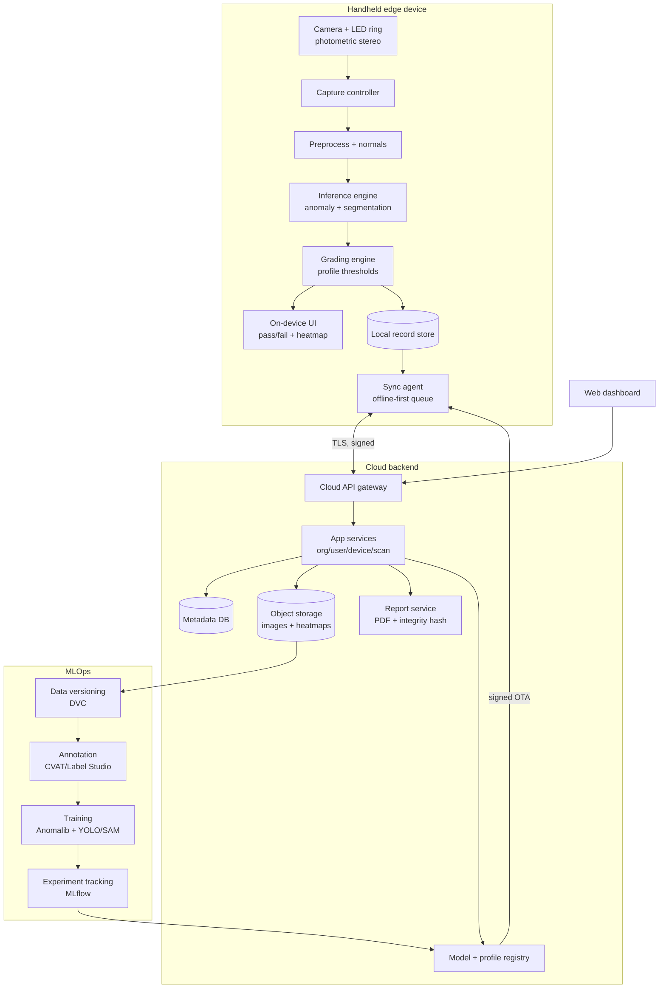

# Technical Architecture Document — StoneScan

| | |
|---|---|
| **Status** | Draft v0.1 |
| **Scope** | Edge device, ML pipeline, cloud backend, web dashboard, MLOps |
| **Related docs** | PRD, Security & Access, Frontend Spec, Feature Tickets |

---

## 1. System overview

StoneScan has four layers: a **handheld edge device** that captures and inspects, a **cloud backend** that stores records and serves the dashboard, a **web dashboard** for management and reporting, and an **MLOps pipeline** that trains models and pushes them back to devices. The design is **offline-first** (the full inspection flow works with no connectivity) and **data-flywheel-oriented** (consented field captures feed training).

## 2. Components

### 2.1 Capture head (hardware)
Global-shutter machine-vision camera, a multi-angle switchable LED ring for **photometric stereo**, a light **shroud/hood** to control ambient light, and a trigger. The LED sequence and shutter are hardware-triggered/synchronized so each patch yields a set of images under known lighting directions.

### 2.2 Edge device
Jetson Orin Nano-class compute (primary target) or a capable phone (alternate), with battery, touchscreen, and storage. Hosts the edge app and runs all inference locally.

### 2.3 Edge app (on-device software)
- **Capture controller** — drives LED/camera sequence, validates exposure/focus (FR-C1/C5).
- **Preprocessing** — registration of the multi-angle frames, computation of **surface normals / albedo** from photometric stereo (key for fissure-vs-crack, FR-D3).
- **Inference engine** — runs the model bundle (§3) via ONNX Runtime / OpenVINO / TensorRT.
- **Grading engine** — applies the active **grading profile** thresholds to produce pass/fail + grade (FR-D4).
- **Local record store** — embedded DB + local files for offline records (FR-S1).
- **Sync agent** — offline-first queue with conflict-free upload; pulls signed model/profile updates (FR-S6).
- **UI** — see Frontend Spec.

### 2.4 ML model bundle
A versioned bundle deployed together:
1. **Anomaly detector** (Anomalib — PatchCore for accuracy, EfficientAd for edge speed): flags deviation from "good" stone, minimizing labeled-defect needs (FR-D1).
2. **Segmentation/classification** (YOLO-seg / U-Net / distilled SAM 2): localizes and names defects — crack, fissure, pit, stain, chip, impurity (FR-D2).
3. **Fissure-vs-crack discriminator**: uses photometric-stereo surface-normal/relief features to separate filled fissures from structural cracks (FR-D3).
4. **Per-stone-type routing**: selects models/profile by stone type (FR-D6).

### 2.5 Cloud backend
- **API gateway** — authenticated ingestion + dashboard API.
- **App services** — org, user, device, scan/slab, grading-profile services.
- **Metadata DB** — relational store for entities (§5).
- **Object storage** — images, heatmaps, report PDFs.
- **Report service** — renders PDFs, computes record **integrity hashes** (FR-R4).
- **Model & profile registry** — versioned artifacts, signs them for **OTA** delivery (FR-S6).

### 2.6 Web dashboard
React SPA for browse/search, scan detail, reports, grading-profile config, device/user/org management (see Frontend Spec).

### 2.7 MLOps pipeline
- **DVC** for dataset/version control over object storage.
- **CVAT / Label Studio** for annotation and operator-correction labels (FR-S8).
- **Training** with Anomalib + Ultralytics/PyTorch; **MLflow** for experiment tracking and model registry hand-off.
- **Active-learning loop** — low-confidence or operator-flagged scans are prioritized for labeling.

## 3. Data flow

1. Operator triggers a capture → LED/camera sequence produces multi-angle frames.
2. Preprocess registers frames and derives surface normals/albedo.
3. Inference: anomaly map → segmentation/classification → fissure/crack discrimination.
4. Grading engine applies the active profile → pass/fail + grade + defect list.
5. UI shows heatmap + result; a per-slab record is written locally.
6. Sync agent uploads records (images, heatmap, metadata) over TLS when connected.
7. Cloud stores metadata + objects, renders reports, indexes for dashboard search.
8. Consented images flow into DVC → annotation → training → MLflow → registry → signed OTA back to devices.

## 4. Edge inference stack

Models trained in PyTorch are exported to **ONNX**, then optimized per target: **TensorRT** on Jetson, **OpenVINO** on x86, or mobile runtimes on phone. **Quantization** (INT8/FP16) to meet NFR-2 (< 300 ms/patch). The bundle is versioned and signed; the edge verifies signatures before activating (see Security doc).

## 5. Data model (key entities)

| Entity | Key fields |
|---|---|
| Organization | id, name, plan, data-opt-in flag |
| User | id, org_id, role, auth identity |
| Device | id, org_id, enrollment status, current bundle version |
| GradingProfile | id, org_id, stone_type, thresholds, version |
| ScanSession | id, org_id, device_id, operator_id, started_at |
| Slab | id, session_id, label/lot, stone_type, final_grade |
| Scan (patch) | id, slab_id, images_ref, normals_ref, model_version, profile_version, created_at |
| Defect | id, scan_id, type, bbox/mask_ref, confidence |
| Record/Report | id, slab_id, pdf_ref, integrity_hash, created_at |
| ModelBundle | version, components, signature, metrics |
| DatasetVersion | id, dvc_ref, source scans, labels |

## 6. Deployment & scalability

- Cloud: containerized services; object storage + managed relational DB; horizontally scalable API tier (NFR-7/8).
- Edge: immutable signed bundles; staged OTA rollout with rollback.
- Environments: dev / staging / prod; infrastructure-as-code.

## 7. Observability

- Edge: local logs, capture/inference metrics, sync health, battery telemetry (consented).
- Cloud: API metrics, error tracking, storage/DB monitoring.
- ML: per-version metrics in MLflow; **drift monitoring** on incoming scan distributions; alert when accuracy proxy degrades.

## 8. Key technical decisions & rationale

| Decision | Rationale |
|---|---|
| Anomaly-detection-first | Defects are rare/varied; train mostly on "good" stone |
| Photometric stereo | Surface relief separates fissures from cracks; cheaper than 3D scanners |
| Offline-first edge inference | Yards/warehouses lack reliable connectivity; latency/privacy |
| Signed bundles + OTA | Protect proprietary models (the moat) and enable safe updates |
| DVC + MLflow | Reproducible data/model lineage for a data-flywheel product |
| Reusable engine boundaries | Capture, inference, grading kept vertical-agnostic for later markets |
