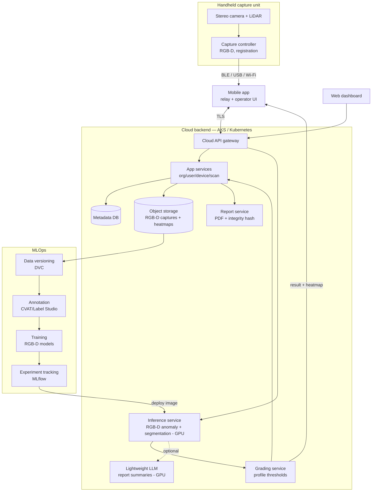

# Technical Architecture Document — StoneScan

| | |
|---|---|
| **Status** | Draft v0.1 |
| **Scope** | Capture device, mobile app, cloud backend (inference), web dashboard, ML pipeline, MLOps |
| **Related docs** | PRD, Security & Access, Frontend Spec, Feature Tickets |

---

## 1. System overview

StoneScan is a **cloud-inference** system: `device (stereo + LiDAR) → mobile app → cloud (AKS) → result to mobile/web`. A **thin handheld capture unit** grabs RGB-D (RGB + LiDAR depth) and streams it to a **paired mobile app**, which relays it to a **cloud backend on Kubernetes** that runs inference, grading, storage, and reporting; a **web dashboard** handles management and reporting; an **MLOps pipeline** trains models and deploys them as images into the cluster. The system is **connected** (inspection requires connectivity — a deliberate trade for a cheap, replaceable device) and **data-flywheel-oriented** (consented field captures feed training). It is sold as a **subscription**; the moat is the RGB-D dataset and the dashboard/inference service, not the hardware.

## 2. Components

### 2.1 Capture head (hardware)
A **stereo camera + LiDAR** unit: synchronized stereo RGB plus a LiDAR depth sensor, with a trigger. Stereo rectification and LiDAR→RGB registration produce a metric **RGB-D** capture per patch — real 3D surface relief, no LED ring or light shroud required. The device is a commodity capture unit: cheap, replaceable, easy to upgrade.

### 2.2 Capture device
Low-cost embedded capture board (camera + LiDAR interface, radio, battery). It captures and streams only — it runs **no inference**. Pairs over BLE / USB / Wi-Fi with a mobile app.

### 2.3 Device + mobile software
- **Capture controller (on device)** — drives the stereo + LiDAR capture, registers RGB-D, validates exposure/focus (FR-C1/C5).
- **Mobile app** — relays captures to the cloud over TLS, shows the operator UI (pass/fail + heatmap), handles enrollment/auth. The app is the bridge and the screen; see Frontend Spec.

### 2.4 ML model (served in-cluster)
Models run as GPU services in the cluster (deployed as container images, no on-device bundle):
1. **Anomaly detector** (Anomalib — PatchCore/EfficientAd, adapted for RGB-D input): flags deviation from "good" stone, minimizing labeled-defect needs (FR-D1).
2. **Segmentation/classification** (YOLO-seg / U-Net / distilled SAM 2): localizes and names defects — crack, fissure, pit, stain, chip, impurity (FR-D2).
3. **Fissure-vs-crack discriminator**: uses LiDAR depth / surface-relief features to separate filled fissures from structural cracks (FR-D3).
4. **Per-stone-type routing**: selects models/profile by stone type (FR-D6).

### 2.5 Cloud backend (Kubernetes / AKS)
- **API gateway** — authenticated ingestion + dashboard API.
- **App services** — org, user, device, scan/slab, grading-profile services.
- **Inference + grading services** — GPU-backed model serving and profile-threshold grading (FR-D1–D4).
- **Metadata DB** — relational store for entities (§5).
- **Object storage** — RGB-D captures, heatmaps, report PDFs.
- **Report service** — renders PDFs, computes record **integrity hashes** (FR-R4).
- **Container registry** — versioned model server images, deployed to the cluster (replaces the old signed-OTA registry).

### 2.6 Web dashboard
React SPA for browse/search, scan detail, reports, grading-profile config, device/user/org management (see Frontend Spec).

### 2.7 MLOps pipeline
- **DVC** for dataset/version control over object storage.
- **CVAT / Label Studio** for annotation and operator-correction labels (FR-S8).
- **Training** with Anomalib + Ultralytics/PyTorch; **MLflow** for experiment tracking and model registry hand-off.
- **Active-learning loop** — low-confidence or operator-flagged scans are prioritized for labeling.

## 3. Data flow

1. Operator triggers a capture → stereo + LiDAR unit produces a registered **RGB-D** frame.
2. Device streams the capture to the paired mobile app.
3. Mobile app uploads the capture to the cloud over TLS.
4. Cloud inference: anomaly map → segmentation/classification → fissure/crack discrimination (on GPU).
5. Grading service applies the active profile → pass/fail + grade + defect list.
6. Result + heatmap returned to the mobile app/dashboard; a per-slab record + objects are stored in the cloud.
7. Cloud indexes metadata for dashboard search and renders reports on demand.
8. Consented captures flow into DVC → annotation → training → MLflow → new model image deployed to the cluster.

## 4. Cloud inference stack

Models trained in PyTorch are served in-cluster on GPU nodes (e.g. ONNX Runtime-GPU or Triton behind a FastAPI/gRPC service), packaged as container images and deployed via the GPU node pools (see `deploy/terraform`). Updating a model is a normal cluster deploy — no per-device bundles, no signing, no OTA. GPU pools scale to zero when idle; a warm node keeps latency low during business hours. A lightweight LLM may run on the spot GPU pool for report summaries / operator Q&A.

## 5. Data model (key entities)

| Entity | Key fields |
|---|---|
| Organization | id, name, plan, data-opt-in flag |
| User | id, org_id, role, auth identity |
| Device | id, org_id, enrollment status, firmware version |
| GradingProfile | id, org_id, stone_type, thresholds, version |
| ScanSession | id, org_id, device_id, operator_id, started_at |
| Slab | id, session_id, label/lot, stone_type, final_grade |
| Scan (patch) | id, slab_id, rgb_ref, depth_ref, model_version, profile_version, created_at |
| Defect | id, scan_id, type, bbox/mask_ref, confidence |
| Record/Report | id, slab_id, pdf_ref, integrity_hash, created_at |
| ModelImage | version, image ref, components, metrics |
| DatasetVersion | id, dvc_ref, source scans, labels |

## 6. Deployment & scalability

- Cloud: AKS with a CPU system pool + GPU node pools (warm + spot); object storage + managed Postgres; horizontally scalable API tier (NFR-7/8). All infra via Terraform (`deploy/terraform`). Reserved GPU capacity is an option when availability is tight.
- Device: commodity capture unit; firmware updates only (no model OTA).
- Environments: dev / staging / prod; infrastructure-as-code.

## 7. Observability

- Device/app: capture quality metrics, upload health, battery telemetry (consented).
- Cloud: API + inference latency metrics, GPU utilization, error tracking, storage/DB monitoring.
- ML: per-version metrics in MLflow; **drift monitoring** on incoming scan distributions; alert when accuracy proxy degrades.

## 8. Key technical decisions & rationale

| Decision | Rationale |
|---|---|
| Anomaly-detection-first | Defects are rare/varied; train mostly on "good" stone |
| Stereo + LiDAR (RGB-D) | Real 3D surface relief separates fissures from cracks; commodity sensor, no LED rig |
| Cloud inference (thin device) | Cheap, replaceable device; central model iteration with no OTA; GPUs unconstrained by edge budget |
| Subscription model | Device bundled with service; moat is the RGB-D dataset + dashboard/inference |
| AKS + GPU node pools (Terraform) | Free control plane 24/7; GPU scales to zero; reserved capacity optional |
| DVC + MLflow | Reproducible data/model lineage for a data-flywheel product |
| Reusable service boundaries | Capture, inference, grading kept vertical-agnostic for later markets |

> **Trade-off:** this design requires connectivity at inspection time, intentionally giving up the original offline-first guarantee in exchange for a commodity device and central model iteration.
